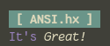

# ANSI.hx

A haxe library with easy access to ANSI commands / escape codes.

Implements most commands allowing for complete control of the terminal.

## Getting Started

install using this git repo

```
haxelib git http://www.github.com/snsvrno/ansi-hx.git
```

and then use to make rich terminal applications

```haxe
import ansi.Paint.*;
// you can use single commands it change different aspects

Sys.println(background(Cyan) + bold() + " [ ANSI.hx ] " + reset());
Sys.println(color(Magenta) + "It's " + italic() + color() + "Great!" + italic(false));

// or you can use the paint wrapper

Sys.println(paint(" [ ANSI.hx ] ", null, Cyan, Bold));
Sys.println(paint("It's ", Magenta) + paint("Great!", Standout));
```



## General Usage

There are two main packages:

1. `ansi.Command` - sends commands to the terminal
2. `ansi.Paint` - creates command strings that need to be written to the terminal


