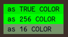

# ANSI.hx

A haxe library with easy access to ANSI commands / escape codes.

Implements most commands allowing for complete control of the terminal.

## Getting Started

install using this git repo

```
haxelib git http://www.github.com/snsvrno/ansi-hx.git
```

and then use to make rich terminal applications

```haxe
import ansi.Paint.*;
// you can use single commands it change different aspects

Sys.println(background(Cyan) + bold() + " [ ANSI.hx ] " + reset());
Sys.println(color(Magenta) + "It's " + italic() + color() + "Great!" + italic(false));

// or you can use the paint wrapper

Sys.println(paint(" [ ANSI.hx ] ", null, Cyan, Bold));
Sys.println(paint("It's ", Magenta) + paint("Great!", Standout));
```


## General Usage

There are two main packages:

1. `ansi.Command` - sends commands to the terminal
2. `ansi.Paint` - creates command strings that need to be written to the terminal

### Features

#### Color Fallback

By default **ANSI.hx** will be using `True Color` mode. This should allow you to print to the terminal using all 24bits of colors.

All though all modern terminals _should_ support this, there maybe some that do not. **ANSI.hx** has a fallback so that things will look somewhat like you want them.

In order to enable fallback you need to run the color mode check function

```haxe
ansi.colors.ColorMode.check();
```

This will determine if the terminal supports `True Color` `256 Color` or just the standard `16` colors.

Everything else will automatically evaluate based on what the terminal supports.

```haxe
Sys.println(backgroundRGB(0, 230, 0));
```

This will show the actual rgb color of (0,230,0) if `True Color`, the closest 256 color of index `46` (0,255,0) in `256 Color` or the standard color of `Green`.


